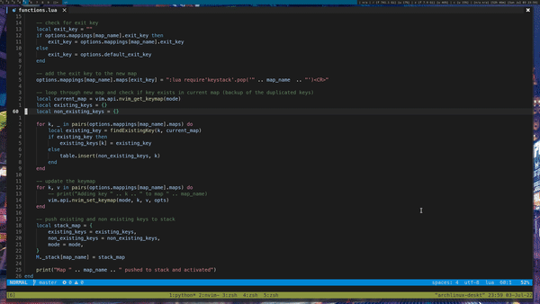

# keystack.nvim

a Simple Neovim Plugin which let you remap Keys on the Fly based on Groups

For Changes please take a look at the [changelog](./README.md#Changelog) section

## Demo



## Usage/Examples

```lua
local keystack = require("keystack")

keystack.setup({
    -- the options which will be used when no options were given inside the mapping
    default_opts = { silent = true },
    -- the key to exit the "Group" when no exit key is given inside the mapping
    default_exit_key = "q", -- You can pass a table instead if you want multiple ways to exit
    -- the mode which will be used when no mode is given inside the mapping 
    default_mode = "n",

    -- where the "Groups" are defined
    mappings = {
        -- name of the Group
        ["page_moving"] = {
            exit_key = "<C-H>",
            mode = "n",
            opts = { silent = true },
            maps = {
                -- key = command
                ["j"] = "<C-D>",
                ["k"] = "<C-U>",
                -- or a function 
                ["<Space>"] = function()
                    -- your function here
                end,
            },
            on_push = function ()
                -- this function gets executed when the group gets pushed
            end,
            on_pop = function ()
                -- this function gets executed when the group gets poped
            end
        },
        ...
    }
})

-- Example Binding for page_moving
vim.api.nvim_set_keymap("n", "<leader>m", ":lua require('keystack').push('page_moving')")
```

## Features

- switch between Key Bindings on the Fly
<!-- - show the new Keys in a floating Window -->

## Documentation

Type `:help keystack` in Neovim

## Installation

Using [packer.nvim](https://github.com/wbthomason/packer.nvim)

```lua
use { "Jxstxs/keystack.nvim" }
```

## Changelog

* to configure your mappings you can now also use `require("keystack").setup({...})`
* you can define function which will get executed when pushing or popping the keys from the stack

## Contributing

Contributions are always welcome! Just remember to be Kind

## License

This Project uses the MIT License, as mentioned [here](./LICENSE).
